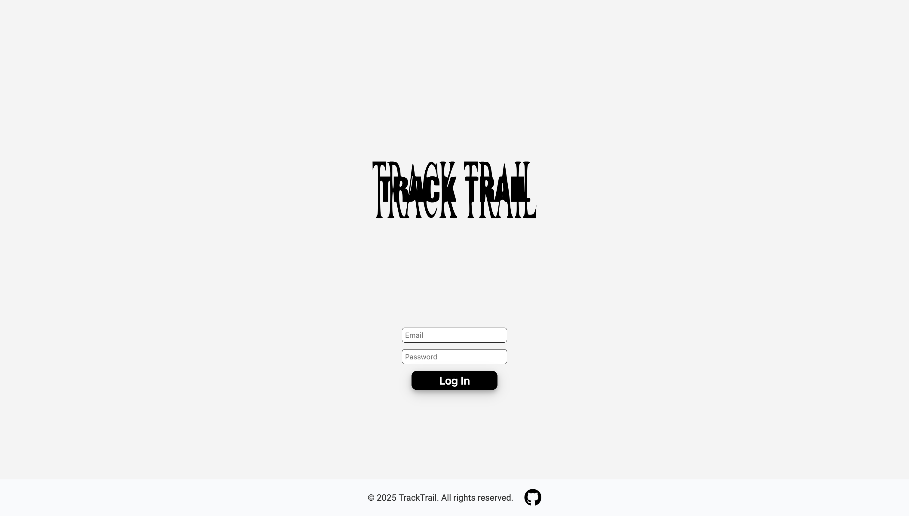
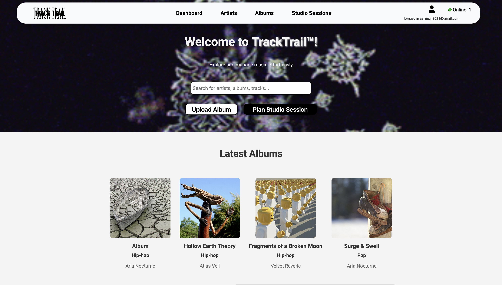
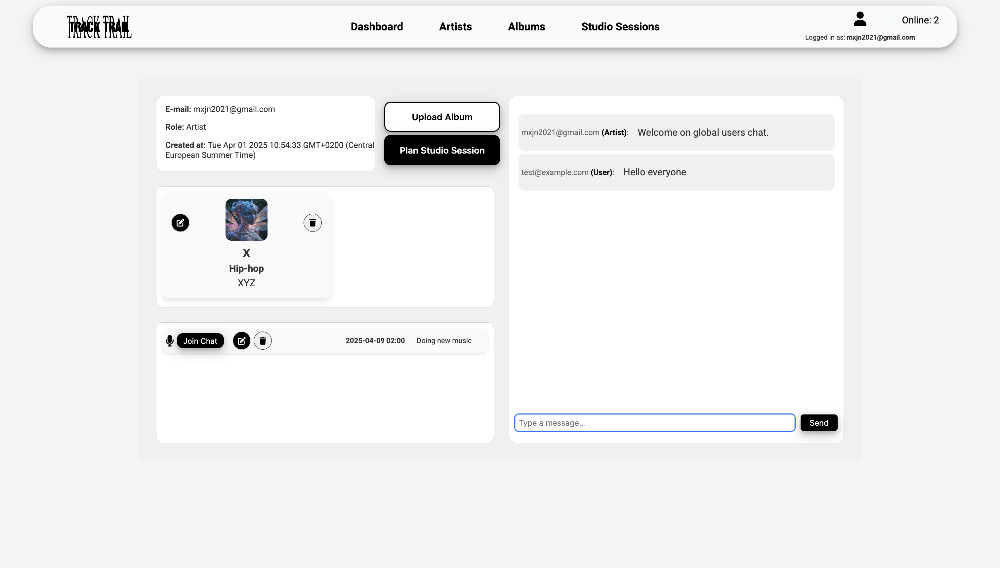
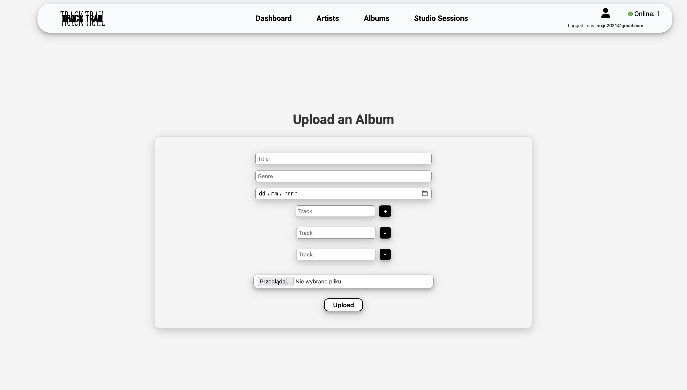
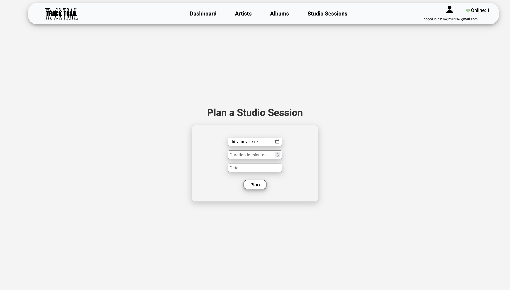
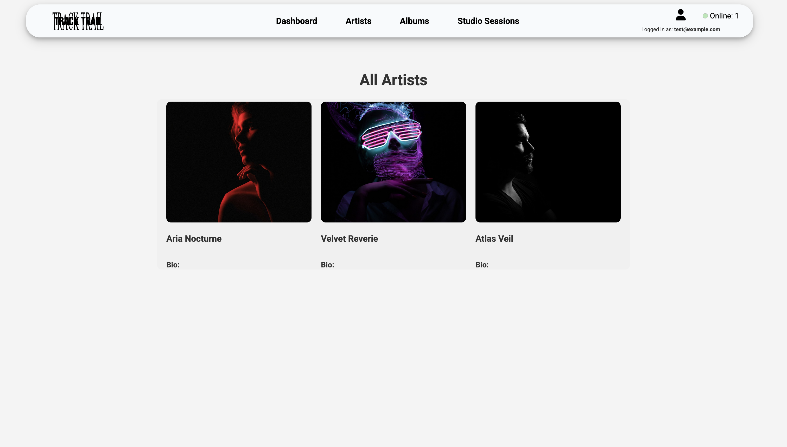
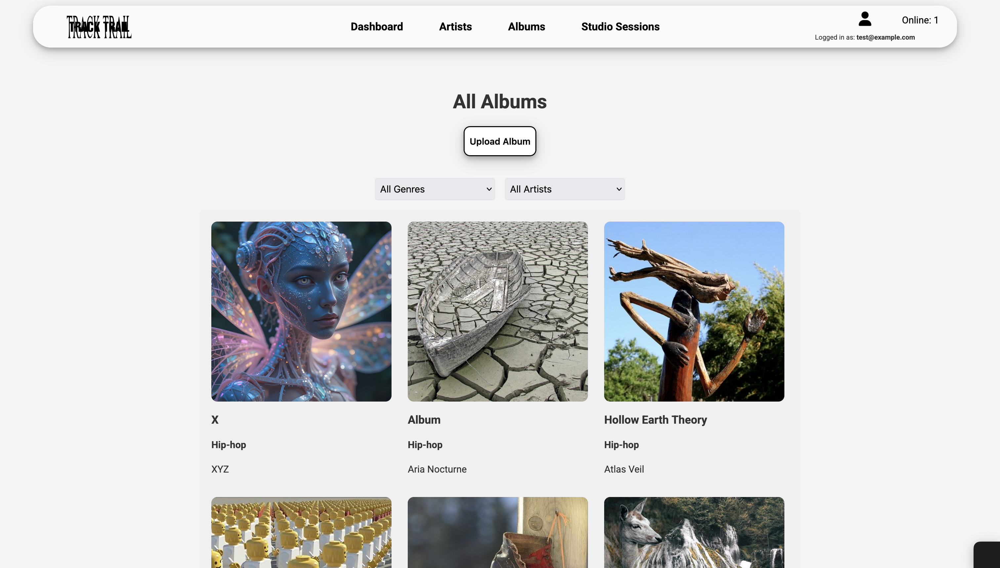
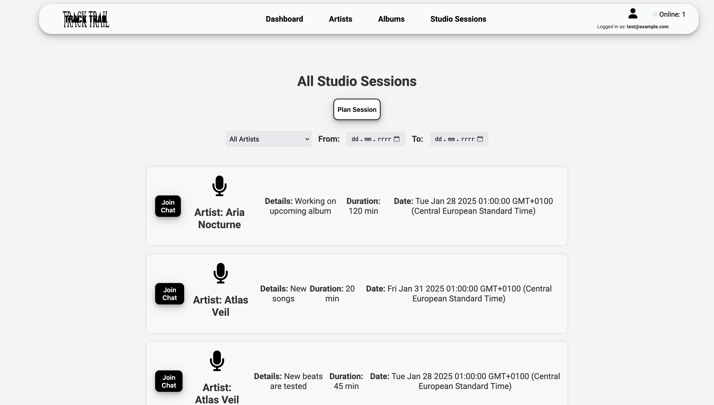

# TrackTrail - Music Label Management App

## Project Description

TrackTrail is a music label management application that enables artists and users to manage albums, studio sessions, and interact through chat. The application offers various features depending on the user's role (artist or user).

## Features

### For Artists:
- **Profile Management**: Edit profile information, including profile picture and biography.
- **Album Creation**: Add new albums, including title, genre, release date, and track list.
- **Album Editing**: Update existing albums.
- **Album Deletion**: Remove albums from the database.
- **Studio Session Planning**: Create new studio sessions, including date, details, and duration.

### For Users:
- **Album Browsing**: Browse available albums and their details.
- **Artist Browsing**: Browse artist profiles.
- **Subscriptions**: Subscribe to artists to receive notifications about new albums and studio sessions.
- **Chat**: Participate in chats during studio sessions.

### General Features:
- **User Authorization**: Registration and login using Passport.js.
- **Real-time Notifications**: Send notifications via MQTT and emails via Nodemailer for users with the user role.
- **Secure Communication**: HTTPS server with SSL/TLS certificates.

## Technologies

- **Backend**: Node.js, Express.js, MongoDB, Mongoose
- **Frontend**: EJS, SCSS, JavaScript
- **Authorization**: Passport.js
- **Notifications**: MQTT, Nodemailer
- **Chat**: Socket.io

## Project Structure (approximate)

```
music_label_management_app/
├── api/
│   ├── controllers/          # Application logic
│   ├── middleware/           # Middleware (e.g., authorization)
│   ├── models/               # Mongoose models
│   └── routes/               # API routes
├── public/                   # Static files (CSS, JS, images)
├── views/                    # EJS views
├── main.js                   # Main server file
├── notif_centre.js           # Notification center
├── run.sh                    # Script to run the application
├── package.json              # Node.js configuration
└── README.md                 # Project documentation
```

## Screenshots


### Registration Page

Registration form for new users, allowing role selection (artist or user).

### Login Page

Login panel for existing users.

### Main Page

The main page of the application, where users can browse the latest albums and studio sessions.

### Dashboard

Personalized dashboard with access to features dependent on the user's role.

### Album Upload Page

Form allowing artists to add new albums.

### Studio Session Upload Page

Form allowing artists to plan studio sessions.

### Artists List

Page with artist profiles that users can browse.

### Albums List

View of all available albums with the ability to browse details.

### Studio Sessions List

View of scheduled studio sessions, available for users and artists.

## Authors

- **MaksJanu** - [GitHub](https://github.com/MaksJanu)